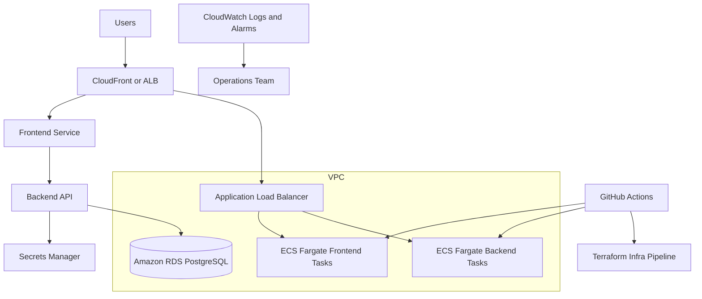

# Architecture and Deployment Guide

## Table of Contents

1. Executive Summary
2. Workload Scope
3. High-Level Architecture
4. Deployment Approaches
5. AWS Services and Design Decisions
6. Infrastructure as Code Strategy
7. Environment Strategy
8. CI/CD Architecture
9. Security and Secrets Management
10. Monitoring, Logging, and Alerting
11. Rollback and Disaster Recovery
12. Deployment Flows
13. Repository Structure
14. Operational Runbook
15. Pre-Production Checklist

## 1. Executive Summary

This solution implements a production-grade AWS platform for:

- Next.js frontend
- Python backend (FastAPI)
- PostgreSQL database (Amazon RDS)

The design supports two deployment approaches:

- Containerized deployment using Amazon ECS Fargate
- Non-containerized deployment using AWS Amplify (frontend) and Elastic Beanstalk (backend)

The architecture enforces strict separation between infrastructure delivery and application delivery through distinct CI/CD workflows.

## 2. Workload Scope

### Applications

- Frontend: Next.js runtime service
- Backend: Python API service
- Data: PostgreSQL relational database

### Non-Functional Requirements

- High availability across multiple Availability Zones
- Elastic scalability for API and web tiers
- Zero-trust oriented service connectivity using security groups
- Secrets outside code and repositories
- Observability for runtime and data tier

## 3. High-Level Architecture



## 4. Deployment Approaches

### A. Containerized

- Frontend and backend are built as Docker images.
- Images are pushed to Amazon ECR.
- ECS Fargate services deploy both workloads behind an ALB.
- ALB route rules direct `/api/*` to backend and default traffic to frontend.

### B. Non-containerized

- Frontend is deployed through Amplify with branch-based builds.
- Backend is deployed to Elastic Beanstalk using zipped Python source bundles.
- Same RDS and VPC-based controls can be retained.

## 5. AWS Services and Design Decisions

### Networking

- Amazon VPC with public, private-app, and private-db subnet tiers
- Internet Gateway for internet ingress/egress from public subnets
- NAT Gateway for private subnet egress
- Multi-AZ subnet strategy for resilience

### Compute

- ECS Fargate for containerized production path:
  - No host management
  - Independent scaling of frontend/backend
  - Native integration with CloudWatch, IAM, and ALB
- Elastic Beanstalk + Amplify for non-containerized path:
  - Faster onboarding for teams avoiding container operations

### Database

- Amazon RDS for PostgreSQL
- Encrypted storage using KMS
- Automated backups and retention policy
- Multi-AZ enabled for staging/prod

### Security

- Security groups isolate ALB, compute, and DB layers
- IAM task execution roles with least-privilege secret access
- AWS Secrets Manager for DB credentials
- KMS CMK for data-at-rest encryption

### Monitoring

- CloudWatch log groups per service
- RDS CPU utilization alarm
- Container Insights enabled for ECS cluster telemetry

## 6. Infrastructure as Code Strategy

Terraform is organized into reusable modules:

- `network`: VPC, subnets, routing, NAT
- `security`: SGs and KMS
- `database`: RDS + Secrets Manager integration
- `ecs_stack`: ALB, ECS cluster/services, autoscaling, logs
- `noncontainer_stack`: Amplify + Elastic Beanstalk
- `observability`: CloudWatch alarms

Environment composition directories:

- `infra/environments/dev`
- `infra/environments/staging`
- `infra/environments/prod`

State management:

- S3 backend per environment key
- DynamoDB state locking

## 7. Environment Strategy

- Dev: cost-optimized baseline (`single_nat_gateway`, non-Multi-AZ DB by default)
- Staging: production-like controls, Multi-AZ DB, full test gates
- Prod: strongest durability and retention settings

Promotion model:

- Merge to main after PR checks
- Apply to dev/staging/prod through controlled infra workflow

## 8. CI/CD Architecture

### Pipeline Separation Requirement (Implemented)

1. Infrastructure pipeline (`infra-terraform.yml`):
- Triggered only when files under `infra/**` change or manual dispatch.
- Runs init, fmt, validate, plan (PR/manual), apply (main).
- Handles only Terraform resources.

2. Containerized application pipeline (`app-containerized.yml`):
- Triggered only by app and container deployment file changes.
- Builds/pushes images to ECR.
- Triggers ECS service rollout.
- Does not call Terraform.

3. Non-containerized application pipeline (`app-noncontainerized.yml`):
- Packages backend and deploys to Elastic Beanstalk.
- Triggers frontend build in Amplify.
- Does not call Terraform.

## 9. Security and Secrets Management

### Secrets

- Database password is generated by Terraform and stored in AWS Secrets Manager.
- Runtime receives only secret ARN and retrieves value at runtime using IAM role.
- No plaintext credentials in source control or Terraform variables.

### Access Control

- OIDC-based GitHub Actions authentication to AWS role (`configure-aws-credentials`).
- No static AWS keys in repository secrets.
- Separate IAM roles can be created per workflow and environment.

### Hardening Recommendations

- Add AWS WAF in front of ALB/CloudFront.
- Enforce TLS-only ingress with ACM certificates.
- Add VPC endpoints for Secrets Manager, ECR, and CloudWatch.
- Enable GuardDuty, Security Hub, and Config conformance packs.

## 10. Monitoring, Logging, and Alerting

- Application logs to CloudWatch log groups per service.
- ECS service health through ALB checks (`/` and `/health`).
- RDS CPU alarm as initial SLI guardrail.

Recommended extensions:

- Error-rate alarms and p95 latency alarms
- Dashboards for request count, target response time, and DB connections
- Structured JSON logging and trace correlation IDs

## 11. Rollback and Disaster Recovery

### Application Rollback

- ECS: redeploy previous image tag and force new deployment.
- Elastic Beanstalk: set prior application version.
- Amplify: redeploy prior successful job/commit.

### Infrastructure Rollback

- Use Terraform state history + versioned S3 backend.
- Revert infra code in Git and re-apply via infra workflow.

### Database Recovery

- Point-in-time recovery via RDS automated backups.
- Cross-region snapshot copy for critical environments (recommended).

## 12. Deployment Flows

### Infra Provisioning

1. Configure remote state bucket and lock table.
2. Copy `terraform.tfvars.example` to `terraform.tfvars` per environment.
3. Run:

```bash
cd infra/environments/dev
terraform init -backend-config=backend.hcl
terraform plan -var-file=terraform.tfvars
terraform apply -var-file=terraform.tfvars
```

### Containerized App Delivery

1. Commit application changes.
2. `app-containerized.yml` builds images and pushes to ECR.
3. ECS services roll out with deployment circuit breaker.

### Non-containerized App Delivery

1. Commit application changes.
2. `app-noncontainerized.yml` zips backend and publishes EB version.
3. Amplify release job deploys frontend branch.

## 13. Repository Structure

- `infra/`: Terraform modules and environment compositions
- `apps/frontend`: Next.js application
- `apps/backend`: Python FastAPI application
- `deploy/containerized`: Dockerfiles per service
- `deploy/non-containerized`: Amplify and Beanstalk deployment assets
- `.github/workflows`: CI/CD pipelines
- `docs/`: architecture and runbook documentation

## 14. Operational Runbook

### Routine Operations

- Review CloudWatch alarms daily.
- Verify ECS desired vs running tasks.
- Validate RDS storage growth and slow query metrics.

### Incident Process

1. Identify affected layer (frontend, backend, DB, network).
2. Check latest deployment and logs.
3. If deployment-related, rollback immediately.
4. If infra-related, freeze app deploys and run infra hotfix process.

## 15. Pre-Production Checklist

- [ ] OIDC roles configured for each workflow
- [ ] Terraform remote state bucket and lock table active
- [ ] ACM certificates validated
- [ ] WAF policies attached
- [ ] DB backup retention and PITR verified
- [ ] CloudWatch alarms routed to on-call SNS
- [ ] Load/performance test completed
- [ ] Rollback drill executed in staging
